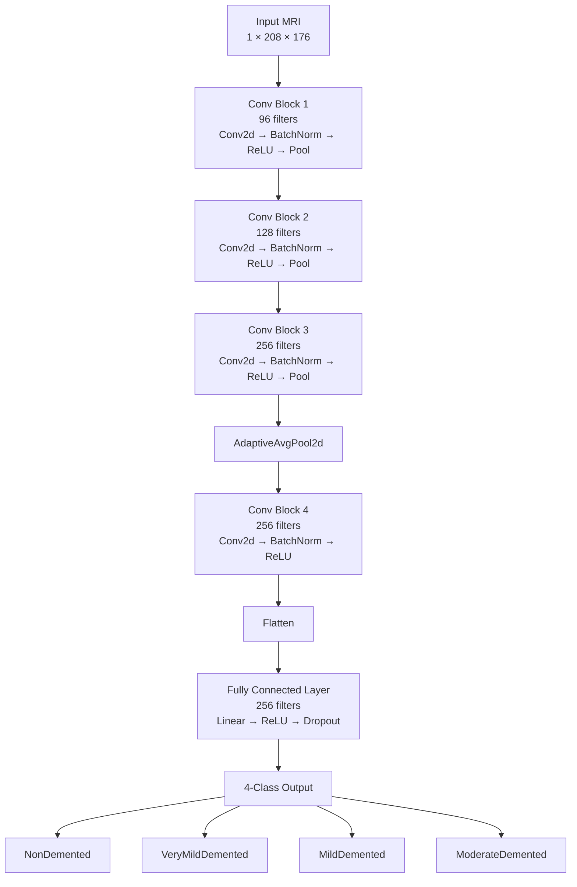

# Alzheimer-s-CNN-MRI-Imaging-Classification

## Overview
This project investigates the use of convolutional neural networks (CNNs) to classify Alzheimer's disease severity from brain MRIs. The model classifies MRI scans into four categories: NonDemented, VeryMildDemented, MildDemented, and ModerateDemented. The primary goal of the project was to optimize a baseline CNN implemented in PyTorch to distinguish these four classes, particularly for the difficult distinction between NonDemented and VeryMildDemented cases. As a result, several modifications were explored, such as focal loss, weighted class sampling, fractional max pooling, image jittering, and other techniques.

## Dataset
The dataset used in this project was obtained from Mendeley Data: "Advancing Alzheimer’s Disease Detection in Clinical Settings: MRI Image Data" by Abu Sufian. The dataset can be accessed here: https://data.mendeley.com/datasets/xx9zzz6t54/1

This publicly available dataset contains 6,400 preprocessed MRI images. However, patient-level demographic and clinical information was unavailable, limiting the ability to account for patient-specific factors during model development and evaluation. Additionally, the substantial class imbalance, particularly the limited number of ModerateDemented images, was taken into consideration during model development and training. A breakdown of the dataset by diagnostic class and split is shown below.

| Class | Training | Test | Total |
|---|---:|---:|---:|
| NonDemented | 2,560 | 640 | **3,200** |
| VeryMildDemented | 1,792 | 448 | **2,240** |
| MildDemented | 717 | 179 | **896** |
| ModerateDemented | 52 | 12 | **64** |
| **Total** | **5,121** | **1,279** | **6,400** |

### Preprocessing
Before model development, the dataset was programmatically inspected to verify image properties, dimensions, and class distributions (using image_analysis.py). The original images were grayscale JPEGs with dimensions of 208 × 176 pixels. 

### Augmentation
Before training, images were converted to grayscale and resized to 208 × 176 pixels. Additionally, data augmentation was applied through random rotations, affine translations, and brightness/contrast adjustments. Validation and test images were resized and converted to grayscale without random augmentation.

## Model Architecture
The project uses a baseline convolutional neural network (CNN) implemented in PyTorch. The full model architecture is shown below.

See the logbook for more details on implementation.

## Model Features
Note that this table only contains the model features in the final version of the model. For all model features tested, see the logbook.

| Component | Configuration |
|---|---|
| Framework | PyTorch |
| Optimizer | Adam |
| Learning Rate | 0.0001 |
| Kernel Size | 3 x 3 |
| Batch Size | 32 |
| Pooling | FractionalPooling, MaxPool2D, Global Average Pooling |
| Loss Function | Focal Loss |
| Class Balancing | Weighted Random Sampling |
| Learning Rate Scheduler | `ReduceLROnPlateau` |
| Weight Decay | Applied |
| Gradient Clipping | Applied |
| Epochs | 50 |
| Stratified K-Fold | 5 Folds |
| Data Augmentation | Random rotation, affine translation, brightness/contrast adjustment |
| Model Selection | Highest validation macro F1 score |

## Experimental Results

## Conclusions

## Limitations and Future Work

## Run Instructions
1) Install the required Python packages:   
pip install -r requirements.txt   
2) Run the dataset analyzer:    
python3 image_analysis.py
3) Run the models:      
python3 cnnR1toR4.py     
python3 cnnR5.py

## Note
This project was developed as part of my personal learning so I could get more familiar with machine learning models, along with some common ML workflows.
