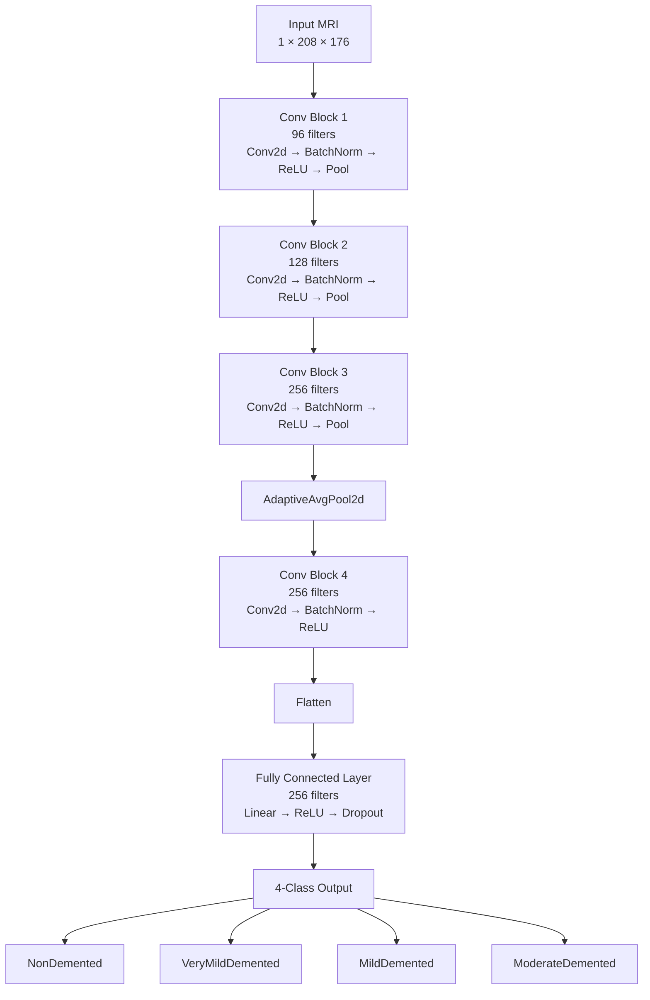

# Alzheimer-s-CNN-MRI-Imaging-Classification

## Overview
This project investigates the use of convolutional neural networks (CNNs) to classify Alzheimer's disease severity from brain MRIs. The model classifies MRI scans into four categories: NonDemented, VeryMildDemented, MildDemented, and ModerateDemented. The primary goal of the project was to optimize a baseline CNN implemented in PyTorch to distinguish these four classes, particularly for the difficult distinction between NonDemented and VeryMildDemented cases. As a result, several modifications were explored, such as focal loss, weighted class sampling, fractional max pooling, image jittering, and other techniques.

## Dataset
The dataset used in this project was obtained from Mendeley Data: "Advancing Alzheimer’s Disease Detection in Clinical Settings: MRI Image Data" by Abu Sufian. The dataset can be accessed here: https://data.mendeley.com/datasets/xx9zzz6t54/1

This publicly available dataset contains 6,400 preprocessed MRI images. However, patient-level demographic and clinical information was unavailable, limiting the ability to account for patient-specific factors during model development and evaluation. Additionally, the substantial class imbalance, particularly the limited number of ModerateDemented images, was taken into consideration during model development and training. A breakdown of the dataset by diagnostic class and split is shown below.

| Class | Training | Test | Total |
|---|---:|---:|---:|
| NonDemented | 2,560 | 640 | **3,200** |
| VeryMildDemented | 1,792 | 448 | **2,240** |
| MildDemented | 717 | 179 | **896** |
| ModerateDemented | 52 | 12 | **64** |
| **Total** | **5,121** | **1,279** | **6,400** |

### Preprocessing
Before model development, the dataset was programmatically inspected to verify image properties, dimensions, and class distributions (using image_analysis.py). The original images were grayscale JPEGs with dimensions of 208 × 176 pixels. 

### Augmentation
Before training, images were converted to grayscale and resized to 208 × 176 pixels. Additionally, data augmentation was applied through random rotations, affine translations, and brightness/contrast adjustments. Validation and test images were resized and converted to grayscale without random augmentation.

## Model Architecture
The project uses a baseline convolutional neural network (CNN) implemented in PyTorch. The full model architecture is shown below.

See the logbook for more details on implementation.

## Model Features
Note that this table only contains the model features in the final version of the model. For all model features tested, see the logbook.

| Component | Configuration |
|---|---|
| Framework | PyTorch |
| Optimizer | Adam |
| Learning Rate | 0.0001 |
| Kernel Size | 3 x 3 |
| Batch Size | 32 |
| Pooling | FractionalPooling, MaxPool2D, Global Average Pooling |
| Loss Function | Focal Loss |
| Class Balancing | Weighted Random Sampling |
| Learning Rate Scheduler | `ReduceLROnPlateau` |
| Weight Decay | Applied |
| Gradient Clipping | Applied |
| Epochs | 50 |
| Stratified K-Fold | 5 Folds |
| Data Augmentation | Random rotation, affine translation, brightness/contrast adjustment |
| Model Selection | Highest validation macro F1 score |

## Experimental Results
The model was evaluated using 5-fold stratified cross-validation on the training set, followed by a final evaluation on the held-out test set. Five different random seeds were applied to an independent train/test dataset split, resulting in the table below:

### Random Seed Robustness

| Seed |     CV Macro F1 | Test Macro F1 |
| ---: | --------------: | ------------: |
|   42 | 0.9203 ± 0.0239 |     **0.768** |
|  123 | 0.8751 ± 0.0241 |     **0.720** |
|  456 | 0.8519 ± 0.1146 |     **0.329** |
|  789 | 0.8601 ± 0.0923 |     **0.428** |
| 2026 | 0.8347 ± 0.0709 |     **0.840** |

*Cross-validation.* Across the five random seeds, the model achieved a mean macro validation F1 score of 0.8684 ± 0.0325 (see table above). The best-performing seed (Seed 42) achieved a mean macro validation F1 of 0.9203, while the worst-performing seed (Seed 2026) achieved a mean macro validation F1 of 0.8347. Additionally, observing the best fold's confusion matrix from each seed (see Logbook) indicates that the model correctly classified the majority of cases. The majority of misclassified cases consisted of VeryMildDemented cases misclassified as NonDemented and NonDemented cases misclassified as VeryMildDemented.

*Test Set Evaluation.* Across the five random seeds, the final models — retrained on the full training set for several epochs informed by the cross-validation results — were evaluated once on the held-out test set (n=1,279). This evaluation produced a mean macro test F1 score of 0.6170 ± 0.2246, substantially lower than the cross-validation results with a wider variance. Additionally, the confusion matrix on the test set (as shown below) demonstrates where the model made notable errors in misclassification; for example, in seed 456, the model misclassified a majority of VeryMildDemented images as ModerateDemented images, and in seed 789, the model misclassified a majority of VeryMildDemented images as NonDemented images. This pattern was not present to the same degree in the cross-validation results, where confusion was comparatively minor and concentrated between adjacent severity classes.

### Test Confusion Matrices

Rows = true class, columns = predicted class.
Class order: **MildDemented, ModerateDemented, NonDemented, VeryMildDemented**

| Seed 42                                                                                | Seed 123                                                                                | Seed 456                                                                                  |
| -------------------------------------------------------------------------------------- | --------------------------------------------------------------------------------------- | ----------------------------------------------------------------------------------------- |
| `[[115, 0, 30, 35],` ` [0, 4, 8, 1],` ` [0, 0, 617, 23],` ` [2, 0, 33, 413]]` | `[[179, 0, 1, 0],` ` [6, 7, 0, 0],` ` [60, 0, 562, 18],` ` [121, 0, 97, 230]]` | `[[7, 172, 1, 0],` ` [0, 13, 0, 0],` ` [0, 242, 363, 35],` ` [0, 276, 14, 158]]` |
| **F1: 0.768**                                                                          | **F1: 0.720**                                                                           | **F1: 0.329**                                                                             |

| Seed 789                                                                             | Seed 2026                                                                                |
| ------------------------------------------------------------------------------------ | ---------------------------------------------------------------------------------------- |
| `[[29, 5, 146, 0],` ` [0, 12, 1, 0],` ` [0, 0, 640, 0],` ` [0, 3, 440, 5]]` | `[[173, 0, 5, 2],` ` [1, 12, 0, 0],` ` [16, 0, 610, 14],` ` [57, 0, 134, 257]]` |
| **F1: 0.428**                                                                        | **F1: 0.840**                                                                            |

## Conclusions
During the first few iterations of the model, the primary difficulties encountered were 1) the oscillating cross-validation loss/accuracy between epochs and 2) the relatively low cross-validation accuracy of the model. Regarding the first problem, it was believed that the oscillation originated from 

## Limitations and Future Work
One important limitation to note in this project is that there were no associated patient labels with the MRI images. Thus, data leakage may have occurred between classes, especially if multiple brain slices from the same patient have been distributed across the training, validation, and test sets. The model could also have benefited from integrating other, complementary information beyond structural imaging alone, such as patient demographic data (e.g., sex, socioeconomic status, or MMSE), potentially improving the model's diagnostic performance. Additionally, the ModerateDemented class in this dataset was extremely small, only containing 64 images in total. Thus, data augmentation was especially important for the model to increase the diversity of training examples and reduce the risk of overfitting. Although medical cases like ModerateDemented AD are relatively rare in datasets like these, a larger number of cases would likely improve the model's ability to generalize to this class. 

Thus, future work could focus on using larger MRI-based datasets, such as Washington University's Open Access Series of Imaging Studies (OASIS) or the Alzheimer's Disease Neuroimaging Initiative (ADNI)*. These datasets also have the benefit of containing other relevant information for the model as well, such as patient labels and demographic information. In particular, future work could also investigate not just 2D, but 3D MRIs as well, allowing the model to potentially make more accurate predictions based on complete brain volumes and additional spatial information. Additionally, transfer learning, such as the ResNet18 model, could help the model converge faster and improve the model's predictive performance. Finally, incorporating explainability techniques like Grad-CAM and saliency maps could also help visualize the brain regions that contribute most to each prediction and improve model interpretability. 

*These datasets were not used in this study because access requires an application and data use agreement that were outside the scope and timeline of this project.

## Run Instructions
1) Install the required Python packages:   
pip install -r requirements.txt   
2) Run the dataset analyzer:    
python3 image_analysis.py
3) Run the models:      
python3 cnnR1toR4.py     
python3 cnnR5.py

## Note
This project was developed as part of my personal learning so I could get more familiar with machine learning models, along with some common ML workflows.
