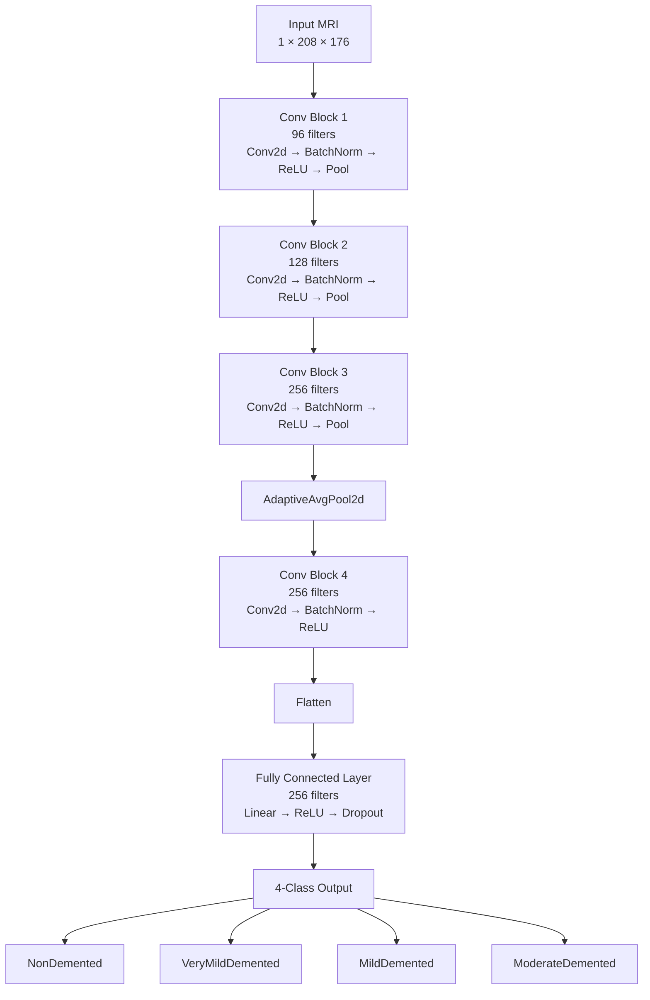

# Alzheimer-s-CNN-MRI-Imaging-Classification

## Overview
This project investigates the use of convolutional neural networks (CNNs) to classify Alzheimer's disease severity from brain MRIs. The model classifies MRI scans into four categories: NonDemented, VeryMildDemented, MildDemented, and ModerateDemented. The primary goal of the project was to optimize a baseline CNN implemented in PyTorch to distinguish these four classes, particularly for the difficult distinction between NonDemented and VeryMildDemented cases. As a result, several modifications were explored, such as focal loss, weighted class sampling, fractional max pooling, image jittering, and other techniques.

## Dataset
The dataset used in this project was obtained from Mendeley Data: "Advancing Alzheimer’s Disease Detection in Clinical Settings: MRI Image Data" by Abu Sufian. The dataset can be accessed here: https://data.mendeley.com/datasets/xx9zzz6t54/1

This publicly available dataset contains 6,400 preprocessed MRI images. However, patient-level demographic and clinical information was unavailable, limiting the ability to account for patient-specific factors during model development and evaluation. Additionally, the substantial class imbalance, particularly the limited number of ModerateDemented images, was taken into consideration during model development and training. A breakdown of the dataset by diagnostic class and split is shown below.

| Class | Training | Test | Total |
|---|---:|---:|---:|
| NonDemented | 2,560 | 640 | **3,200** |
| VeryMildDemented | 1,792 | 448 | **2,240** |
| MildDemented | 717 | 179 | **896** |
| ModerateDemented | 52 | 12 | **64** |
| **Total** | **5,121** | **1,279** | **6,400** |

### Preprocessing
Before model development, the dataset was programmatically inspected to verify image properties, dimensions, and class distributions (using image_analysis.py). The original images were grayscale JPEGs with dimensions of 208 × 176 pixels. 

### Augmentation
Before training, images were converted to grayscale and resized to 208 × 176 pixels. Additionally, data augmentation was applied through random rotations, affine translations, and brightness/contrast adjustments. Validation and test images were resized and converted to grayscale without random augmentation.

## Model Architecture
The project uses a baseline convolutional neural network (CNN) implemented in PyTorch. The full model architecture is shown below.

See the logbook for more details on implementation.

## Model Features
Note that this table only contains the model features in the final version of the model. For all model features tested, see the logbook.

| Component | Configuration |
|---|---|
| Framework | PyTorch |
| Optimizer | Adam |
| Learning Rate | 0.0001 |
| Kernel Size | 3 x 3 |
| Batch Size | 32 |
| Pooling | FractionalPooling, MaxPool2D, Global Average Pooling |
| Loss Function | Focal Loss |
| Class Balancing | Weighted Random Sampling |
| Learning Rate Scheduler | `ReduceLROnPlateau` |
| Weight Decay | Applied |
| Gradient Clipping | Applied |
| Epochs | 50 |
| Stratified K-Fold | 5 Folds |
| Data Augmentation | Random rotation, affine translation, brightness/contrast adjustment |
| Model Selection | Highest validation macro F1 score |

## Experimental Results
The model was evaluated using 5-fold stratified cross-validation on the training set, followed by a final evaluation on the held-out test set.

*Cross Validation.* Across the five folds, the model achieved a mean macro F1 score of 0.9485 (± 0.0135), with individual fold macro F1 scores ranging from 0.9257 to 0.9609 (see table below). The best-performing fold (Fold 1) achieved a macro F1 of 0.961 on its validation split, with per-class F1 scores of 0.983 (MildDemented), 1.000 (ModerateDemented), 0.944 (NonDemented), and 0.917 (VeryMildDemented). Additionally, the confusion matrix for the best-performing fold, shown below, indicates that the model correctly classified the majority of cases. The majority of misclassified cases consisted of VeryMildDemented cases misclassified as NonDemented (31/359 true cases) and NonDemented cases misclassified as VeryMildDemented (25/512 true cases).

| Fold | Best Epoch | Val Loss | Val Accuracy | Val Macro F1 |
|------|-----------|----------|---------------|----------------|
| 1    | 34/50     | 0.0680   | 0.9405        | 0.9609         |
| 2    | 19/50     | 0.1092   | 0.9062        | 0.9257         |
| 3    | 40/50     | 0.0656   | 0.9414        | 0.9546         |
| 4    | 36/50     | 0.0805   | 0.9355        | 0.9489         |
| 5    | 33/50     | 0.0761   | 0.9346        | 0.9523         |

**Macro F1: 0.9485 ± 0.0135**

*Test Set Evaluation.* The final model — retrained on the full training set for several epochs informed by the cross-validation results — was evaluated once on the held-out test set (n=1,279). This evaluation produced a macro F1 score of 0.568 and an overall accuracy of 0.643, substantially lower than the cross-validation results. Per-class F1 scores on the test set were 0.440 (MildDemented), 0.500 (ModerateDemented), 0.682 (NonDemented), and 0.651 (VeryMildDemented).

The confusion matrix on the test set (as shown below) shows that the majority of MildDemented misclassifications (111 of 179 true cases) were predicted as VeryMildDemented, and a substantial share of NonDemented cases (277 of 640) were also predicted as VeryMildDemented. This pattern was not present to the same degree in the cross-validation results, where confusion was comparatively minor and concentrated between adjacent severity classes.

<table>
<tr>
<th>Validation Set (Best Fold)</th>
<th>Test Set</th>
</tr>
<tr>
<td>

| True \ Pred | Mild | Moderate | Non | VeryMild |
|---|---|---|---|---|
| **Mild**     | 142 | 0  | 0   | 2   |
| **Moderate** | 0   | 10 | 0   | 0   |
| **Non**      | 2   | 0  | 485 | 25  |
| **VeryMild** | 1   | 0  | 31  | 327 |

</td>
<td>

| True \ Pred | Mild | Moderate | Non | VeryMild |
|---|---|---|---|---|
| **Mild**     | 53 | 0 | 15  | 111 |
| **Moderate** | 2  | 4 | 2   | 4   |
| **Non**      | 3  | 0 | 360 | 277 |
| **VeryMild** | 4  | 0 | 39  | 405 |

</td>
</tr>
</table>

## Conclusions

## Limitations and Future Work
One important limitation to note in this project is that there were no associated patient labels with the MRI images. Thus, data leakage may have occurred between classes, especially if multiple brain slices from the same patient have been distributed across the training, validation, and test sets. Additionally, the ModerateDemented class in this dataset was extremely small, only containing 64 images in total. Thus, data augmentation was especially important for the model to increase the diversity of training examples and reduce the risk of overfitting. Although medical cases like ModerateDemented AD are relatively rare, 
## Run Instructions
1) Install the required Python packages:   
pip install -r requirements.txt   
2) Run the dataset analyzer:    
python3 image_analysis.py
3) Run the models:      
python3 cnnR1toR4.py     
python3 cnnR5.py

## Note
This project was developed as part of my personal learning so I could get more familiar with machine learning models, along with some common ML workflows.
